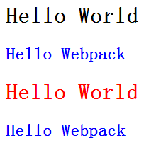

# CSS Module
>css-loader?modules 启用CSS模块规范。
这意味着默认情况下，您的模块的CSS是局域范围的CSS。您可以通过选择器和/或规则关闭全局（...）。

	--app.css
    .h1 {
	  color:red;
	}
	
	:global(.h2) {
	  color: blue;
	}

	--main.jsx
	var React = require('react');
	var ReactDOM = require('react-dom');
	var style = require('./app.css');
	
	ReactDOM.render(
	  

	    <h1 className={style.h1}>Hello World</h1>
	    <h2 className="h2">Hello Webpack</h2>
	  
,
	  document.getElementById('example')
	);
	
	--loaders:[
	  {
        test: /\.css$/,
        loader: 'style-loader!css-loader?modules'
      }
	]
　　显示效果 
 
你会发现只有第二个h1是红色的，因为它的CSS是局部作用域，而h2都是蓝色的，因为它的CSS是全局范围的。

同时记住要装webpack-dev-server和webpack